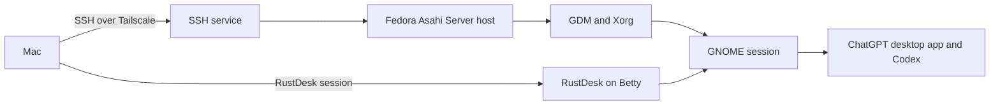

# Headless RustDesk and ChatGPT desktop transition

**Status:** Superseded. The Fedora 44 GNOME live test invalidated this design.

**Date:** 2026-08-12

## Purpose

This document explains a proposed graphical desktop for Betty.

Betty is a Fedora Asahi Remix 44 Server system on an ARM64 M2 Mac mini. It is
managed through SSH and Tailscale. No monitor is planned. The aim is to use the
official ChatGPT desktop app, including Codex, from a Mac through RustDesk.

This proposed design was an in-place GNOME installation with GDM, Xorg, the
Xorg dummy driver, and RustDesk headless support. It is a custom Fedora Server
change. It is not an Asahi-documented conversion from the Server variant to the
GNOME variant.

The 2026-08-12 live test invalidated the design. Fedora 44 GNOME has no X11
session. Fedora's official Fedora 43 Wayland-only GNOME change states that GDM
itself requires Wayland. RustDesk documents that remote login-screen access
requires X11. The GNOME, GDM, and RustDesk X11-login assumptions cannot all be
true on this host.

## Superseded decision summary

Use these components:

| Component | Selected role |
| --- | --- |
| GNOME | The user desktop and application environment. |
| GDM | The graphical login manager. |
| Xorg | The documented RustDesk no-display prerequisite. |
| Xorg dummy driver | The virtual display implementation used by RustDesk. |
| RustDesk | Remote screen, keyboard, mouse, and clipboard access from the Mac. |
| SSH and Tailscale | Independent management and recovery access. |
| ChatGPT desktop app | The official Fedora ARM64 application inside the GNOME session. |

This design gave priority to a remote graphical session without an attached
monitor. It did not give priority to the Fedora Asahi KDE flagship desktop.

## Why this design

The requirements are not fully aligned.

Fedora Asahi presents KDE Plasma as its flagship desktop. It also provides a
GNOME variant. Both documented desktop variants are Wayland-first. KDE is the
best platform-aligned option when a local display is available.

RustDesk documents different requirements for access when no display exists.
Its `allow-linux-headless` setting requires a desktop environment, an Xorg
server, and GDM. Its headless guide names GNOME as the supported desktop,
lists the Xorg dummy driver for Fedora, and says the path was only tested on
Ubuntu. RustDesk also documents that remote login-screen access needs X11. Its
Wayland support is experimental.

No monitor is planned for Betty. Therefore, the RustDesk requirements decide
the boot and login design. GNOME and GDM match the documented headless desktop
pair. Xorg and its dummy driver provide the virtual display path.

OpenAI supports Fedora 44 and ARM64 for the ChatGPT Linux preview. OpenAI says
that native Wayland support is experimental. In a Wayland session, the app uses
XWayland when it is available. If Fedora supplies a GNOME on Xorg session, the
first application test will use it to remove native-Wayland-preview behavior.

This last point is an engineering inference. OpenAI does not state that Xorg is
required or preferred. The first ChatGPT test must still prove application
startup, sign-in, rendering, input, and Codex access.

## System model



SSH does not depend on the graphical stack. If RustDesk, GDM, Xorg, GNOME, or the
ChatGPT app fails, SSH remains the control path.

## What each component does

### GNOME

GNOME supplies the graphical shell, windows, settings, applications, and user
session. It is not only a graphics-driver package.

Fedora Asahi supplies GNOME as a desktop variant. It also states that Fedora
Asahi supports M1 and M2 Mac mini systems.

### GDM

GDM is the login manager. It starts a graphical sign-in screen and starts the
selected user session after successful sign-in.

GDM is GNOME's normal login manager. RustDesk also names GDM as a headless
prerequisite. Only GDM will be enabled.

### Xorg

Xorg is the X11 display server. It provides the X11 login path required by the
RustDesk documentation. It is not the normal Asahi desktop default.

The Xorg dummy driver creates a virtual display when no physical display is
attached. RustDesk includes a dummy Xorg configuration with virtual display
modes. The Fedora test must prove that it works with the Asahi graphics stack.

RustDesk requires an X11 GDM login screen for pre-login access. Its documents
do not require every logged-in GNOME session to use X11. The test will use a
GNOME on Xorg session first if Fedora supplies it. It will record the actual
session type before claiming RustDesk desktop support.

### RustDesk

RustDesk transports an existing graphical screen and accepts remote input. It
does not create a desktop by itself.

The RustDesk headless setting permits an incoming connection with no physical
display. The documented prerequisites are a desktop environment, Xorg, and
GDM. The setting is off by default.

### ChatGPT desktop app

The official Linux preview supports Fedora 43 and 44 on ARM64. It provides a
Fedora ARM64 RPM. The app includes access to ChatGPT, projects, local files,
and Codex.

The app is installed only after the graphical session and RustDesk path work.
Its account sign-in is a manual user action. Do not record account details,
tokens, or application secrets in tickets or terminal output.

## Meaning of `graphical.target`

Systemd targets define the boot service set.

| Target | Effect on Betty |
| --- | --- |
| `multi-user.target` | Starts normal network services, SSH, Tailscale, Docker, and text logins. This is the current default. |
| `graphical.target` | Starts the multi-user services and the enabled display manager. It then exposes a graphical login screen. |

`systemctl set-default graphical.target` changes the target used at the next
boot. It does not itself install a desktop, create a screen, or log a user in.

`systemctl isolate graphical.target` changes the active target now. It is a
runtime test. It does not change the next boot unless the default target also
changes.

The graphical target must not be enabled until GDM, Xorg, and the SSH recovery
test pass.

## Chosen operating sequence

This sequence is intentional. Each change has a separate approval boundary.

1. Run read-only package and service checks.
2. Preview the full DNF transaction.
3. Obtain approval for the GNOME, GDM, Xorg, and dummy-driver package install.
4. Install the approved packages while the default remains `multi-user.target`.
5. Verify package installation and the existing SSH, Tailscale, Docker, and
   Netdata services.
6. Check which display-manager and GNOME session units exist on Betty.
7. Enable GDM, but do not enable another display manager.
8. Confirm a second SSH session works.
9. Set `graphical.target` as the boot default after explicit approval.
10. Reboot or isolate the graphical target under the Step 9 procedure.
11. Verify the GDM X11 login screen through RustDesk with no physical display.
12. Start and verify a GNOME session through RustDesk.
13. Install the official ChatGPT ARM64 RPM after explicit approval.
14. Test ChatGPT, Codex, input, rendering, clipboard, and a restart.

Steps 1 through 10 belong to the graphical-session ticket. Steps 11 through 14
belong to the RustDesk and ChatGPT validation ticket.

## Required proof before success

Do not mark the transition complete until all checks pass.

### Base host proof

- The root filesystem has sufficient free space after the transaction preview.
- `sshd`, `tailscaled`, Docker, and Netdata remain active.
- `systemctl --failed` reports no new failed system units.
- A second SSH session remains usable after every boot or target change.
- The Immich disks remain detached until their separate restoration step.

### Desktop proof

- The DNF transaction installs GNOME, GDM, Xorg, and the dummy driver without
  unexpected removals.
- GDM is the only enabled display manager.
- `graphical.target` starts GDM at boot.
- GDM uses X11 for the remote login screen.
- The selected GNOME session starts successfully.
- The test records the actual session type. Test GNOME on Xorg first when it
  is available.

### RustDesk proof

- RustDesk installs from a verified ARM64 Fedora RPM.
- RustDesk connects from the Mac when no physical display is attached.
- The Mac can view the GDM login screen after a reboot.
- The Mac can sign in to GNOME and control the session.
- Keyboard, pointer, clipboard, and reconnect behavior work.
- SELinux denials, if any, are investigated. SELinux must not be disabled as a
  shortcut.

### ChatGPT and Codex proof

- The official ARM64 Fedora RPM installs without an unreviewed repository
  change.
- The application starts inside the verified GNOME session.
- The user completes sign-in locally through RustDesk.
- The app renders and accepts keyboard input.
- Codex opens and can access an approved local project.
- The application restarts successfully after a host reboot.

## Alternatives considered

### Keep the current Server system

**Description:** Keep `multi-user.target`. Use SSH and the ChatGPT desktop app
on the Mac.

**Benefits:** This has the least host risk. It keeps the existing recovery and
service model unchanged.

**Reason not selected:** It cannot run the Linux ChatGPT desktop app on Betty.
It also does not provide a graphical RustDesk workspace.

### Reinstall the supported Fedora Asahi KDE image

**Description:** Back up Betty, then install the official KDE Fedora Asahi
variant from macOS.

**Benefits:** This is the documented Fedora Asahi desktop deployment. KDE is
the flagship desktop and Wayland is the normal Asahi desktop path.

**Reason not selected now:** A reinstall replaces the current system and
requires service reconstruction. It also does not independently solve
no-display RustDesk login access. RustDesk still documents X11, GDM, and Xorg
for its headless path.

**When to reconsider:** Choose this option if the custom package conversion
fails, or if a durable local desktop becomes more important than remote-only
operation.

### Add KDE with Plasma Login Manager and Wayland

**Description:** Install KDE and use its normal Wayland-first display manager.

**Benefits:** This most closely matches the desktop Fedora Asahi promotes. It
uses the platform-preferred desktop protocol.

**Reason not selected:** RustDesk documents Wayland support as experimental. It
also states that the Wayland login screen cannot be remotely accessed after a
reboot. This leaves no supported remote bootstrap path without a monitor.

**When to reconsider:** Use this design with a tested HDMI or USB-C display, or
a tested display emulator, if the remote-login requirement becomes optional.

### KDE with GDM, Xorg, and RustDesk

**Description:** Install KDE, replace its normal login manager with GDM, and
use Xorg for RustDesk headless support.

**Benefits:** KDE remains available. GDM and Xorg meet the general RustDesk
headless prerequisites.

**Reason not selected:** RustDesk's own headless guide identifies GNOME as the
supported desktop. It does not document KDE as a tested Fedora headless
desktop. This would add an unproven desktop and login-manager combination.

**When to reconsider:** Choose this only after a separate KDE headless proof,
or after a physical display is available for the KDE Wayland session.

### KDE with a display emulator

**Description:** Attach an HDMI or USB-C display emulator. Use KDE with the
normal Asahi Wayland design. Connect later with RustDesk.

**Benefits:** This can preserve the usual KDE Wayland path while giving the GPU
a visible output.

**Reason not selected:** It adds a physical dependency. It does not by itself
solve RustDesk's Wayland login-screen limitation. It requires a separate
hardware test on the actual Mac mini.

### Reinstall the Fedora Asahi GNOME image

**Description:** Reinstall the official Fedora Asahi GNOME variant, then add
the Xorg dummy driver and RustDesk.

**Benefits:** This is a documented Fedora Asahi desktop deployment. GDM is
GNOME's normal login manager.

**Reason not selected now:** A reinstall replaces the current Server system and
requires service reconstruction. It does not remove the need to prove the
RustDesk no-display path on this exact hardware.

## Known risks and limits

| Risk | Effect | Control |
| --- | --- | --- |
| Server-to-desktop conversion is custom | Asahi does not document it as a variant switch. | Use DNF previews, small gates, and SSH rollback. |
| RustDesk Fedora headless guidance is incomplete | The RustDesk guide says it was only tested on Ubuntu. | Treat Fedora Asahi operation as a bounded experiment. |
| RustDesk no-display path can fail | No remote graphical bootstrap occurs. | Keep two SSH sessions and test before the ChatGPT installation. |
| RustDesk Wayland support is experimental | Remote screen or input can fail in a Wayland session. | Test GNOME on Xorg first when it is available. Record the session type. |
| ChatGPT Linux app is preview software | Application features can differ from macOS. | Test core use, Codex, input, and restart before relying on it. |
| Package transaction changes host state | Packages or services can conflict. | Review the exact DNF transaction before approval. |
| Fedora 44 GNOME no longer has X11 | The documented RustDesk GDM X11 login design is incompatible. | Do not continue this design. Return to the Step 8 decision. |

## Rollback and recovery

Keep two independent SSH or Tailscale sessions open before a display-manager
change or reboot.

If graphical boot fails, use SSH to restore the text-first boot default:

```fish
sudo systemctl set-default multi-user.target
sudo systemctl disable --now gdm
sudo reboot
```

Run this only after GDM has been installed and enabled. These commands remove
the graphical boot path. They do not remove GNOME, RustDesk, or user data.

If SSH and Tailscale are unavailable, the recovery path requires local Mac mini
access. This is why a graphical change does not begin until two remote sessions
are confirmed.

Do not remove desktop packages as the first recovery action. First restore
`multi-user.target`, collect the logs, and identify the failed component.

## Security controls

- Keep SSH and Tailscale as the management plane.
- Do not expose RustDesk directly to the public network.
- Configure unattended RustDesk access only after the interactive test passes.
- Use a strong unique RustDesk access secret. Do not print or store it in this
  repository.
- Keep SELinux enforcing. Investigate AVC denials through the supported policy
  path.
- Do not place ChatGPT credentials, RustDesk credentials, or application tokens
  in shell history, tickets, or documents.
- Do not reconnect the detached Immich disks for this desktop transition.

## Boundaries and approvals

This document records a superseded Step 8 decision. It does not approve a
RustDesk install, a default-target change, or a reboot.

The next safe action is to restore `multi-user.target` after the temporary
graphical-target test. Then select a remote desktop design that does not depend
on an unavailable GNOME X11 login screen.

## References

1. [Fedora Asahi Remix](https://asahilinux.org/fedora/). Fedora 44 platform
   support, M1 and M2 Mac mini support, desktop variants, and Wayland-first
   desktop support.
2. [Fedora Asahi Remix 44 release announcement](https://fedoramagazine.org/fedora-asahi-remix-44-is-now-available/).
   Fedora Asahi desktop and Server variants.
3. [OpenAI: ChatGPT desktop app for Linux](https://learn.chatgpt.com/docs/linux/linux-app).
   Fedora 43 and 44 support, ARM64 RPM, and Wayland limitations.
4. [RustDesk: Linux](https://rustdesk.com/docs/en/client/linux/). Fedora RPM
   guidance, experimental Wayland support, and X11 login-screen requirement.
5. [RustDesk: Advanced settings](https://rustdesk.com/docs/en/self-host/client-configuration/advanced-settings/).
   `allow-linux-headless` prerequisites: desktop environment, Xorg, and GDM.
6. [RustDesk: Headless Linux Support](https://github.com/rustdesk/rustdesk/wiki/Headless-Linux-Support).
   GNOME scope, Fedora dummy-driver command, and Ubuntu-only test statement.
7. [RustDesk dummy Xorg configuration](https://github.com/rustdesk/rustdesk/blob/master/res/xorg.conf).
   The virtual display configuration bundled with RustDesk.
8. [systemd.special](https://www.freedesktop.org/software/systemd/man/latest/systemd.special.html).
   Systemd target definitions, including `multi-user.target` and
   `graphical.target`.
9. [Fedora installation troubleshooting](https://docs.fedoraproject.org/en-US/fedora/f33/install-guide/install/Troubleshooting/).
   Fedora guidance for setting `graphical.target` and restoring
   `multi-user.target`.
10. [RustDesk, GDM, and Linux headless access](research-rustdesk-gdm-headless.md).
    Project research note with the source scope and Fedora Server target details.
11. [Fedora: Wayland-only GNOME](https://fedoraproject.org/wiki/Changes/WaylandOnlyGNOME).
    Fedora 43 removal of GNOME X11 and the GDM Wayland requirement.
